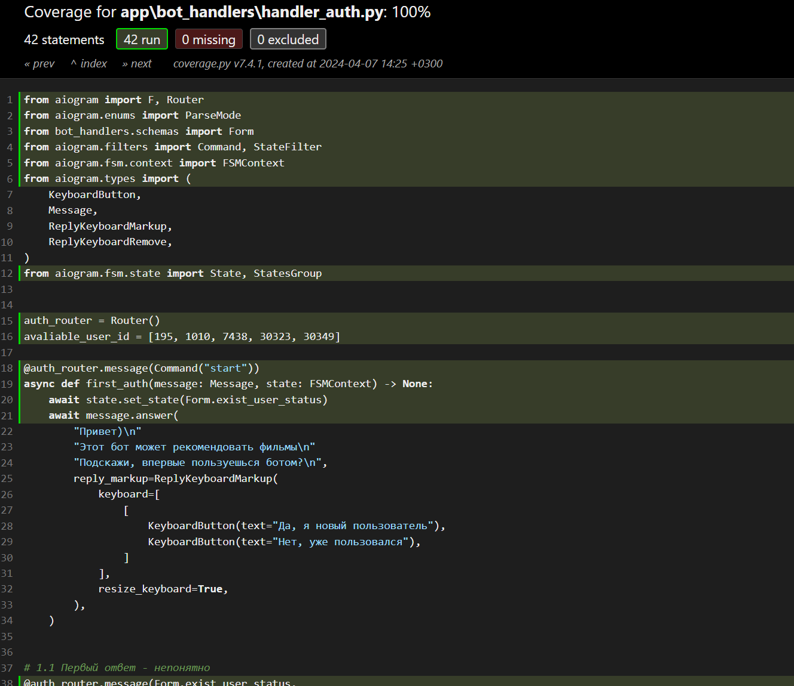
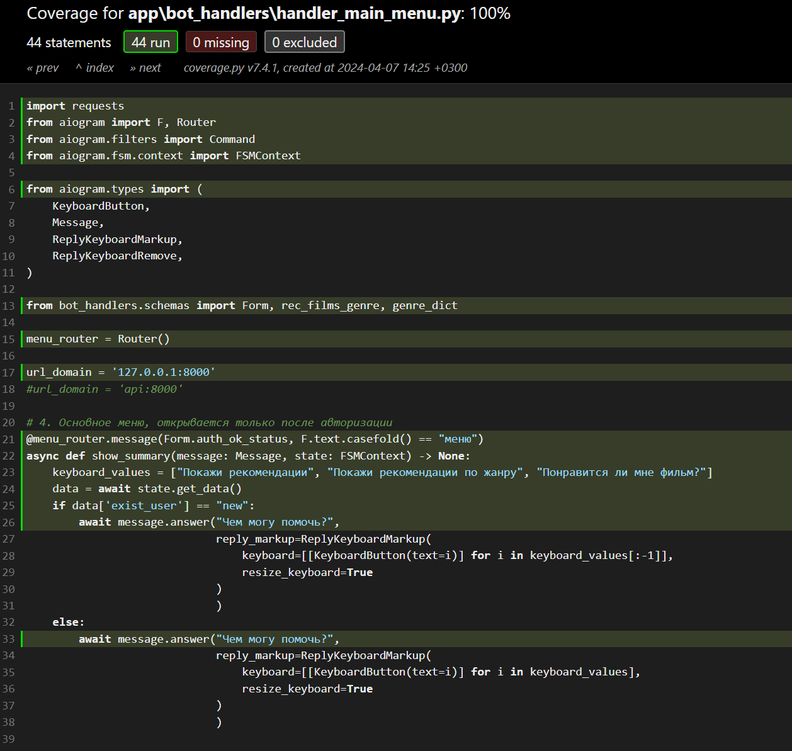

# Тесты
Unit-тесты показали 94% покрытия ручек, не покрыт только поллинг.
Сами тесты находятся в папке tests, отображение покрытий находится в папке tests/htmlcov/main_py.html

Проценты покрытий лежат в [htmlcov](htmlcov), ниже прикреплены скрины:

