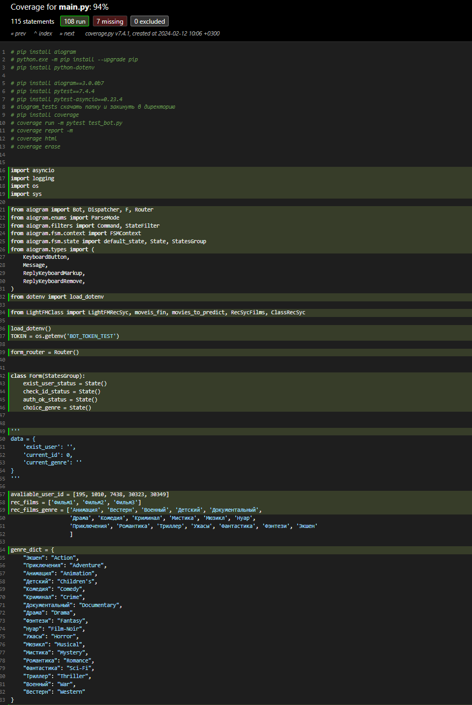
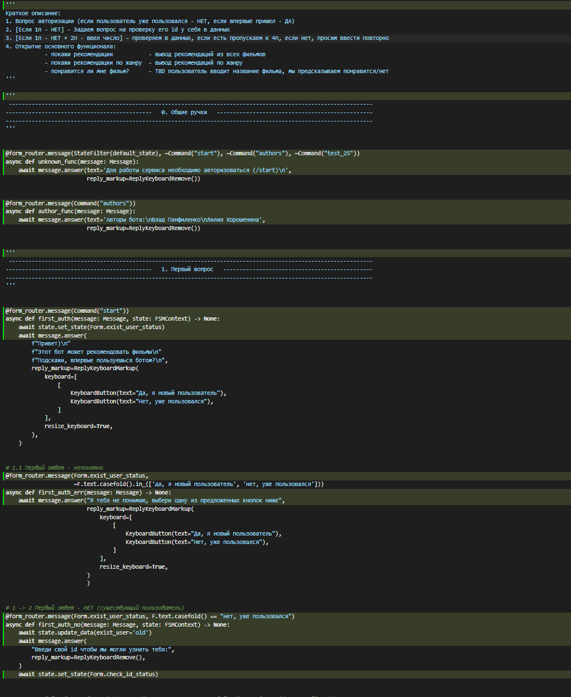
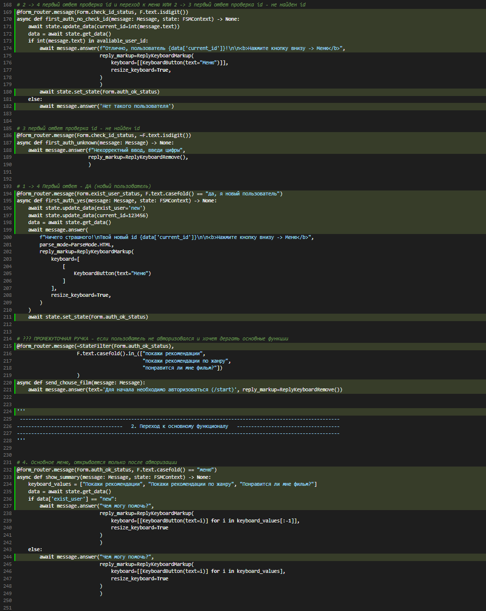
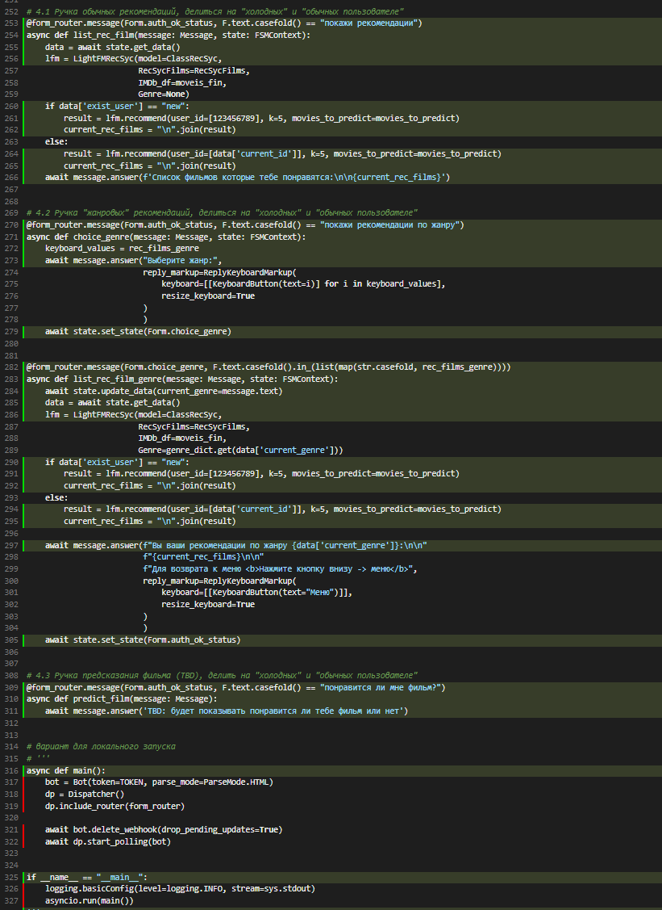

# Что умеет этот бот?
- давать рекомендации фильмов пользователю
- давать рекомендации фильмов пользователю по жанру
- предсказывать понравится ли пользователю фильм(TBD)

### В механику защита интересная особенность - в начале пользования ботом пользователю необходимо пройти авторизацию, после ее прохождения доступны следующие ручки:
1. для авторизованных пользователей:
   - рекомендации фильмов
   - рекомендации фильмов по жанру
   - предсказание понравится ли фильм
2. для новых ("холодных") пользователей:
   - рекомендации фильмов
   - рекомендации фильмов по жанру

В итоге реализовано 5 ручек, с механикой конечного автомата дя запоминания, что ввел пользователь.

# Тут представлено краткое описание как работает бот:
1. Вопрос авторизации:
   - если пользователь уже пользовался --> "Нет, уже пользовался"
   - если впервые пришел --> "Да, я новый пользователь"
2. <Если 1п - НЕТ> - Задаем вопрос на проверку его id у себя в данных
3. <Если 1п - НЕТ + 2п - ввел число> - проверяем в данных, если есть пропускаем к 4п, если нет, просим ввести повторно
4. Открытие основного функционала: 
   - покажи рекомендации
   - покажи рекомендации по жанру
   - понравится ли мне фильм?

# Адрес бота
@pvv_aiogram_bot - после отправки /start необходимо немного подождать, чтобы бот запустился на сервере для прохождения клиентского пути со стороны "известного" пользователя можно использовать id 1010

# Тесты
Unit-тесты показали 94% покрытия ручек, не покрыт только поллинг.
Сами тесты находятся в папке tests, отображение покрытий находится в папке tests/htmlcov/main_py.html

